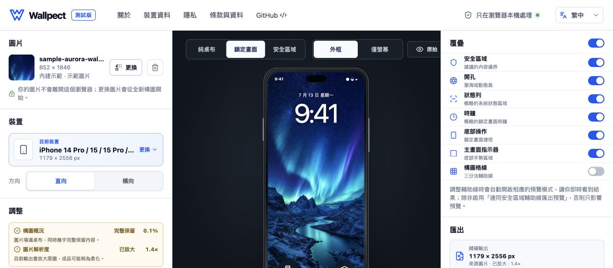
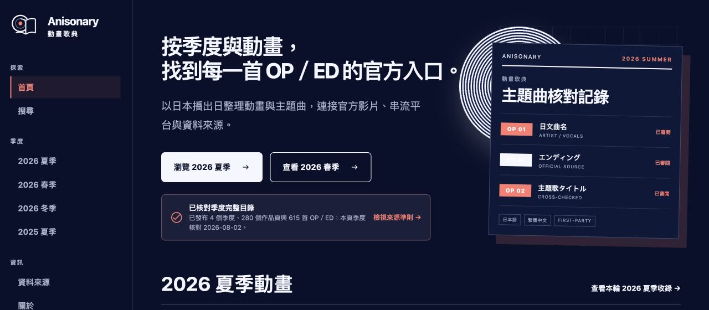
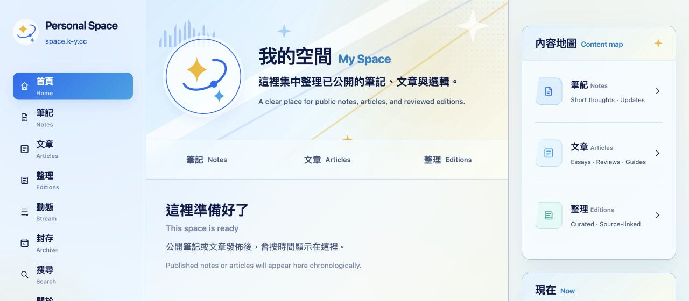
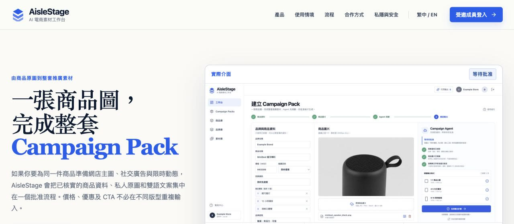
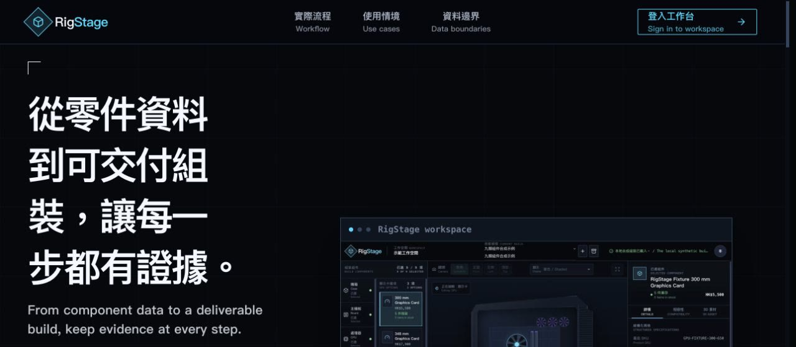
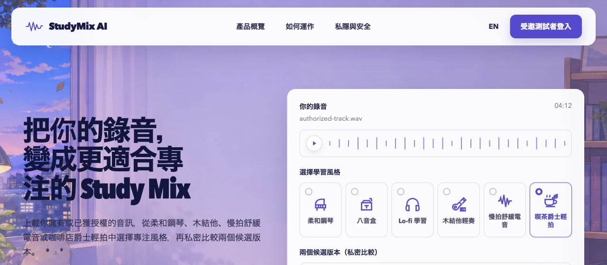

# kyeunga25

把實際問題做成可用、可驗證，而且重視私隱的軟件。

I build practical, verifiable software with clear interfaces, privacy-conscious architecture, and reliable delivery.

[入口網站 / Portfolio](https://k-y.cc) · [安全政策 / Security](SECURITY.md) · [授權 / Licence](LICENSING.md) · [公開開發設定 / Public setup](#公開開發設定--public-development-setup)

| 可用性 / Availability                                               | 成熟度 / Maturity                                                                       | 證據 / Evidence                                                                                |
| ------------------------------------------------------------------- | --------------------------------------------------------------------------------------- | ---------------------------------------------------------------------------------------------- |
| 公開入口與已核對項目索引 / Public portal and verified project index | 只列公開證據；私人測試分開標示 / Public evidence only; private beta labelled separately | [入口網站 / Live](https://k-y.cc) · [驗證工具 / Validator](scripts/validate_public_profile.py) |

## 項目展示 / Project showcase

六個項目集中在同一區域；狀態於 **2026-08-30** 按公開 source、release、文件及正式入口核對。公開產品、closed beta 與 invite-only 工作區會分開標示。

Six projects, one showcase. Status was checked on **30 August 2026** against public source, releases, documentation, and production entry points.

<table>
  <tr>
    <td width="42%" valign="top"></td>
    <td width="58%" valign="top">
      <strong><a href="https://wallpect.k-y.cc">Wallpect</a></strong> 
      <code>Released · v0.4.0</code>
      
在瀏覽器本機預覽、調整並輸出 Apple 裝置桌布；所選圖片不會上載。 Browser-only wallpaper composition and exact-size export without uploading the selected image.

      
<a href="https://wallpect.k-y.cc">Live</a> · <a href="https://github.com/kyeunga25/wallpect">Source</a> · <a href="https://github.com/kyeunga25/wallpect/releases/tag/v0.4.0">Release</a> · <a href="https://github.com/kyeunga25/wallpect/tree/main/docs">Docs</a>

    </td>
  </tr>
  <tr>
    <td width="42%" valign="top"></td>
    <td width="58%" valign="top">
      <strong><a href="https://anisonary.k-y.cc">Anisonary｜動畫歌典</a></strong> 
      <code>Public · v1.3.0</code>
      
按季度與日本播出日整理 280 部作品及 615 首 OP／ED，保留逐曲來源記錄。 A source-traceable seasonal directory with local search across 280 titles and 615 OP／ED records.

      
<a href="https://anisonary.k-y.cc">Live</a> · <a href="https://github.com/kyeunga25/anisonary">Source</a> · <a href="https://github.com/kyeunga25/anisonary/releases/tag/v1.3.0">Release</a> · <a href="https://github.com/kyeunga25/anisonary/tree/main/docs">Docs</a>

    </td>
  </tr>
  <tr>
    <td width="42%" valign="top"></td>
    <td width="58%" valign="top">
      <strong><a href="https://space.k-y.cc">Personal Space</a></strong> 
      <code>Public · Source v0.8.0 · Release v0.7.0</code>
      
公開 Notes、Articles、Editions、搜尋與封存；Studio 及寫入操作只限擁有者。 A bilingual publishing space with public reading surfaces and an owner-only Studio.

      
<a href="https://space.k-y.cc">Live</a> · <a href="https://github.com/kyeunga25/personal-space">Source</a> · <a href="https://github.com/kyeunga25/personal-space/releases/tag/v0.7.0">Release</a> · <a href="https://github.com/kyeunga25/personal-space/tree/main/docs">Docs</a>

    </td>
  </tr>
  <tr>
    <td width="42%" valign="top"></td>
    <td width="58%" valign="top">
      <strong><a href="https://aislestage.k-y.cc">AisleStage</a></strong> 
      <code>Closed beta · Invite-only · Source v0.6.0 · Release v0.5.1</code>
      
把獲授權商品圖、已核實雙語資料與人工批准整理成 1:1、4:5、9:16 Campaign Pack。 An invite-only, human-reviewed workflow for coordinated three-format campaign packs.

      
<a href="https://aislestage.k-y.cc">Overview</a> · <a href="https://github.com/kyeunga25/aislestage">Source</a> · <a href="https://github.com/kyeunga25/aislestage/releases/tag/v0.5.1">Release</a> · <a href="https://github.com/kyeunga25/aislestage/tree/main/docs">Docs</a>

    </td>
  </tr>
  <tr>
    <td width="42%" valign="top"></td>
    <td width="58%" valign="top">
      <strong><a href="https://rigstage.k-y.cc">RigStage</a></strong> 
      <code>Invite-only · Source v1.1.0 · Release v1.0.1</code>
      
受保護的產品目錄、私人素材審核與 PC Builder，公開畫面只使用合成資料。 An invite-only catalogue, asset-review, and PC assembly workspace with synthetic public demos.

      
<a href="https://rigstage.k-y.cc">Overview</a> · Private source / 私人原始碼

    </td>
  </tr>
  <tr>
    <td width="42%" valign="top"></td>
    <td width="58%" valign="top">
      <strong><a href="https://studymix.k-y.cc">StudyMix AI</a></strong> 
      <code>Closed beta · Early MVP</code>
      
為已擁有或獲授權的錄音設計私人風格重塑流程；正式上載及外部生成仍停用。 A private audio-restyling MVP with production uploads and external generation disabled.

      
<a href="https://studymix.k-y.cc">Overview</a> · <a href="https://github.com/kyeunga25/studymix-ai">Source</a> · <a href="https://github.com/kyeunga25/studymix-ai/tree/main/docs">Docs</a>

    </td>
  </tr>
</table>

## 工程方向 / Engineering focus

TypeScript、React、Astro、Node.js、Python 與 Cloudflare Workers／Static Assets；重點包括瀏覽器端私隱、受限制的雲端工作流程、可追溯資料、測試自動化及可回復的發佈流程。

TypeScript, React, Astro, Node.js, Python, Cloudflare Workers, and Static Assets, with an emphasis on browser-side privacy, bounded cloud workflows, traceable data, automated testing, and recoverable releases.

## 公開開發設定 / Public development setup

- **[Repository guidance](./AGENTS.md)** — 這個 Profile repository 實際採用的公開安全範圍與完成條件。
- **[Portfolio website](https://github.com/kyeunga25/kyeunga25.github.io)** — `k-y.cc` 的獨立靜態網站 source、project status 與 GitHub Pages 發布文件。
- **[Codex development setup](./codex/)** — 可參考、可審閱的 `AGENTS.md` 與最小權限 `config.toml` 範例。
- **[macOS dotfiles](./dotfiles/)** — 可攜、可審閱的 shell／terminal 設定子集，以及對應的 [Brewfile](./Brewfile)。
- **[Public profile validation](./scripts/validate_public_profile.py)** — 檢查相對連結、公開設定、過時連結及常見敏感資料類別。

The published setup is intentionally a reviewable reference rather than an export of live machine state. It excludes credentials, machine paths, private service mappings, sessions, prompts, and interface preferences.

## 授權 / Licence

`Brewfile`、`codex/**`、`dotfiles/**`、`archive/**`、`scripts/**` 及
相關公開技術文件中的可重用專案自有材料，依 [MIT License](LICENSE) 提供。
Profile／項目文案與編排、`README.md` 內的個人識別元素、`assets/**`、項目
名稱、商標及第三方材料不在 MIT 授權範圍內。

Repository-owned reusable setup examples and validation tools are provided
under the [MIT License](LICENSE). Profile and project copy or arrangement,
personal identity elements in `README.md`, `assets/**`, names, marks, and
third-party material are excluded.

完整邊界見 [`LICENSING.md`](LICENSING.md)、
[`COPYRIGHT.md`](COPYRIGHT.md) 及
[`THIRD_PARTY_NOTICES.md`](THIRD_PARTY_NOTICES.md)。
