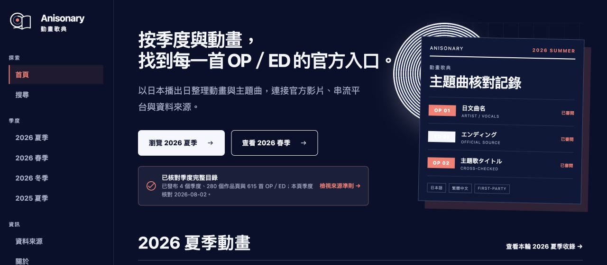
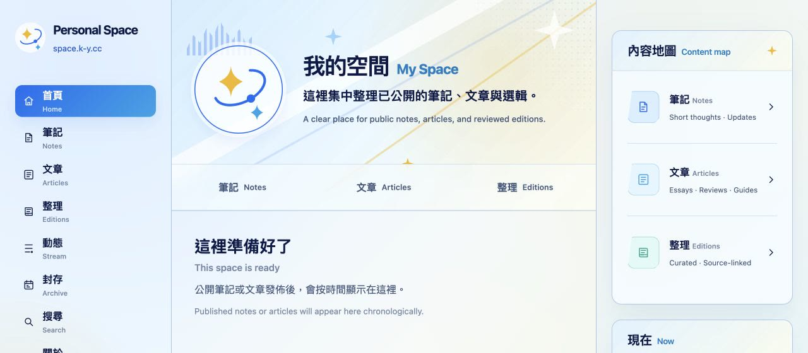
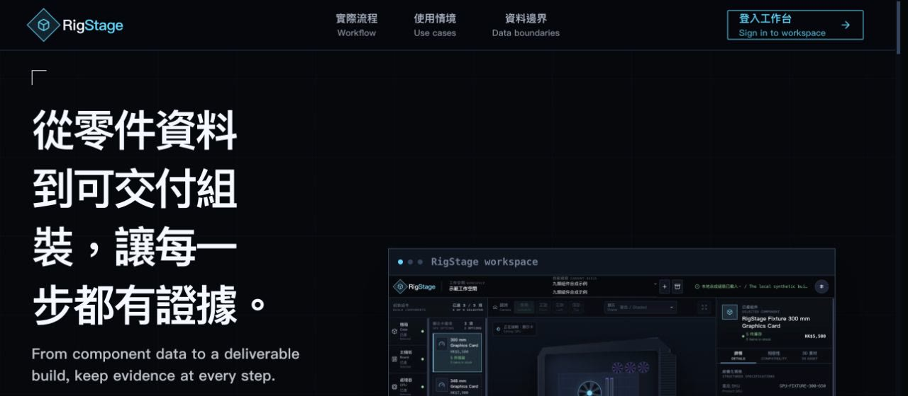

# kyeunga25

把實際問題做成可用、可驗證，而且重視私隱的軟件。

I build practical, verifiable software with clear interfaces, privacy-conscious architecture, and reliable delivery.

[入口網站 / Portfolio](https://k-y.cc) · [安全政策 / Security](SECURITY.md) · [授權 / Licence](LICENSING.md) · [公開開發設定 / Public setup](#公開開發設定--public-development-setup)

| 可用性 / Availability                                               | 成熟度 / Maturity                                                                       | 證據 / Evidence                                                                                |
| ------------------------------------------------------------------- | --------------------------------------------------------------------------------------- | ---------------------------------------------------------------------------------------------- |
| 公開入口與已核對項目索引 / Public portal and verified project index | 只列公開證據；私人測試分開標示 / Public evidence only; private beta labelled separately | [入口網站 / Live](https://k-y.cc) · [驗證工具 / Validator](scripts/validate_public_profile.py) |

## 項目展示 / Project showcase

狀態於 **2026-09-08** 按公開 source、release、文件及網站入口核對。以下六個 repo 均已公開；網站可用性與工作區存取限制分開標示，source 進展不等於已正式發布。

All six repositories are public. Status was checked on **8 September 2026**; public websites, invited workspaces, source progress and releases are labelled separately.

<table>
  <tr>
    <td width="42%" valign="top"></td>
    <td width="58%" valign="top">
      <strong><a href="https://anisonary.k-y.cc">Anisonary｜動畫歌典</a></strong> 
      <code>Public repo</code> 
      Live · Source v1.31.1 · Release v1.31.0
      
具來源記錄的動畫 OP／ED 目錄，涵蓋 28 個已審閱季度、1,917 部作品及 4,229 筆歌曲；支援本機搜尋、逐曲 credits 與靜態 API。 A source-traceable directory spanning 28 reviewed seasons, 1,917 titles and 4,229 themes, with local search, song credits and a static API.

      
近期擴充 2019 夏季目錄，並加入已核對的演唱者與角色 credits；該季度仍在補充。 Recent source work expands summer 2019 and displays reviewed vocal credits; that quarter is still growing.

      
<a href="https://anisonary.k-y.cc">Live</a> · <a href="https://github.com/kyeunga25/anisonary">GitHub</a> · <a href="https://github.com/kyeunga25/anisonary/releases/tag/v1.31.0">Release</a> · <a href="https://github.com/kyeunga25/anisonary/tree/main/docs">Docs</a>

    </td>
  </tr>
  <tr>
    <td width="42%" valign="top"></td>
    <td width="58%" valign="top">
      <strong><a href="https://space.k-y.cc">Personal Space</a></strong> 
      <code>Public repo</code> 
      Live · Released v0.8.0
      
雙語內容發佈系統，提供公開 Notes、Articles、人工審閱 Editions、搜尋、標籤、月份封存及 RSS；內容管理留在擁有者專用 Studio。 A bilingual publishing system with public notes, articles, reviewed editions, search, tags, archives and RSS, plus an owner-only Studio.

      
v0.8.0 已發布，線上健康檢查亦回報 v0.8.0；近期完善自部署文件及依賴安全檢查。 v0.8.0 is released and reported by the live health endpoint; recent work improves self-hosting docs and dependency checks.

      
<a href="https://space.k-y.cc">Live</a> · <a href="https://github.com/kyeunga25/personal-space">GitHub</a> · <a href="https://github.com/kyeunga25/personal-space/releases/tag/v0.8.0">Release</a> · <a href="https://github.com/kyeunga25/personal-space/tree/main/docs">Docs</a>

    </td>
  </tr>
  <tr>
    <td width="42%" valign="top"></td>
    <td width="58%" valign="top">
      <strong><a href="https://rigstage.k-y.cc">RigStage</a></strong> 
      <code>Public repo</code> 
      Invite-only · Source v1.1.0 · Release v1.0.1
      
邀請制電腦產品目錄、私人 3D 素材審核與 PC Builder，支援保存組裝草稿、已核實規格及可解釋相容性結果。 An invite-only PC catalogue, private 3D asset-review workflow and builder with saved assemblies, verified specifications and explainable compatibility.

      
原始碼現已公開；近期加入多模型預覽及素材審核分頁。工作區仍限受邀使用者，真實 AI 生成預設停用。 Source is now public, with recent multi-model previews and paginated asset review. Workspace access remains invite-only; real AI is disabled by default.

      
<a href="https://rigstage.k-y.cc">Overview</a> · <a href="https://github.com/kyeunga25/pc-ai-3d-builder">GitHub</a> · <a href="https://github.com/kyeunga25/pc-ai-3d-builder/releases/tag/v1.0.1">Release</a> · <a href="https://github.com/kyeunga25/pc-ai-3d-builder/tree/main/docs">Docs</a>

    </td>
  </tr>
  <tr>
    <td width="42%" valign="top"></td>
    <td width="58%" valign="top">
      <strong><a href="https://aislestage.k-y.cc">AisleStage</a></strong> 
      <code>Public repo</code> 
      Closed beta · Invite-only · Source v0.6.0 · Release v0.5.1
      
把獲授權商品圖、已核實雙語資料及人工批准整理成 1:1、4:5、9:16 Campaign Pack。近期 source 加入已批准輸出的本機 PNG 匯出。 An invite-only workflow for human-reviewed, three-format campaign packs. Recent source work adds local PNG export of approved outputs.

      
<a href="https://aislestage.k-y.cc">Overview</a> · <a href="https://github.com/kyeunga25/aislestage">GitHub</a> · <a href="https://github.com/kyeunga25/aislestage/releases/tag/v0.5.1">Release</a> · <a href="https://github.com/kyeunga25/aislestage/tree/main/docs">Docs</a>

    </td>
  </tr>
  <tr>
    <td width="42%" valign="top"></td>
    <td width="58%" valign="top">
      <strong><a href="https://studymix.k-y.cc">StudyMix AI</a></strong> 
      <code>Public repo</code> 
      Closed beta · Early MVP · No public release
      
為自有或獲授權錄音設計私人風格重塑流程；已合併本機音訊預覽及播放檢查，正式上載與外部生成仍停用。 A private audio-restyling MVP with merged local audio preview and playback checks; production uploads and external generation remain disabled.

      
<a href="https://studymix.k-y.cc">Overview</a> · <a href="https://github.com/kyeunga25/studymix-ai">GitHub</a> · <a href="https://github.com/kyeunga25/studymix-ai/tree/main/docs">Docs</a>

    </td>
  </tr>
  <tr>
    <td width="42%" valign="top"></td>
    <td width="58%" valign="top">
      <strong><a href="https://wallpect.k-y.cc">Wallpect</a></strong> 
      <code>Public repo</code> 
      Live · Released v0.4.0
      
在瀏覽器本機預覽、調整及輸出 Apple 裝置桌布；目前 v0.4.0 提供 47 種顯示設定、涵蓋 191 個已列名型號，圖片不會上載。 Browser-only Apple wallpaper preview, fitting and exact-size export. v0.4.0 covers 47 display profiles and 191 named models without image uploads.

      
<a href="https://wallpect.k-y.cc">Live</a> · <a href="https://github.com/kyeunga25/wallpect">GitHub</a> · <a href="https://github.com/kyeunga25/wallpect/releases/tag/v0.4.0">Release</a> · <a href="https://github.com/kyeunga25/wallpect/tree/main/docs">Docs</a>

    </td>
  </tr>
</table>

## 工程方向 / Engineering focus

TypeScript、React、Astro、Node.js、Python 與 Cloudflare Workers／Static Assets；重點包括瀏覽器端私隱、受限制的雲端工作流程、可追溯資料、測試自動化及可回復的發佈流程。

TypeScript, React, Astro, Node.js, Python, Cloudflare Workers, and Static Assets, with an emphasis on browser-side privacy, bounded cloud workflows, traceable data, automated testing, and recoverable releases.

## 公開開發設定 / Public development setup

- **[Repository guidance](./AGENTS.md)** — 這個 Profile repository 實際採用的公開安全範圍與完成條件。
- **[Portfolio website](https://github.com/kyeunga25/kyeunga25.github.io)** — `k-y.cc` 的獨立靜態網站 source、project status 與 GitHub Pages 發布文件。
- **[Codex development setup](./codex/)** — 可參考、可審閱的 `AGENTS.md` 與最小權限 `config.toml` 範例。
- **[macOS dotfiles](./dotfiles/)** — 可攜、可審閱的 shell／terminal 設定子集，以及對應的 [Brewfile](./Brewfile)。
- **[Public profile validation](./scripts/validate_public_profile.py)** — 檢查相對連結、公開設定、過時連結及常見敏感資料類別。

The published setup is intentionally a reviewable reference rather than an export of live machine state. It excludes credentials, machine paths, private service mappings, sessions, prompts, and interface preferences.

## 授權 / Licence

`Brewfile`、`codex/**`、`dotfiles/**`、`archive/**`、`scripts/**` 及
相關公開技術文件中的可重用專案自有材料，依 [MIT License](LICENSE) 提供。
Profile／項目文案與編排、`README.md` 內的個人識別元素、`assets/**`、項目
名稱、商標及第三方材料不在 MIT 授權範圍內。

Repository-owned reusable setup examples and validation tools are provided
under the [MIT License](LICENSE). Profile and project copy or arrangement,
personal identity elements in `README.md`, `assets/**`, names, marks, and
third-party material are excluded.

完整邊界見 [`LICENSING.md`](LICENSING.md)、
[`COPYRIGHT.md`](COPYRIGHT.md) 及
[`THIRD_PARTY_NOTICES.md`](THIRD_PARTY_NOTICES.md)。
